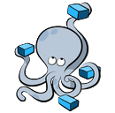
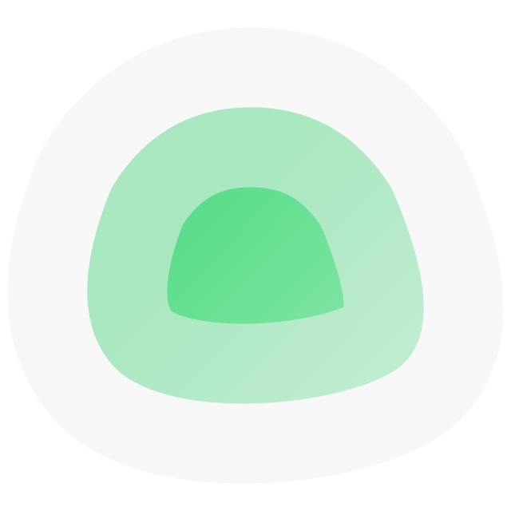
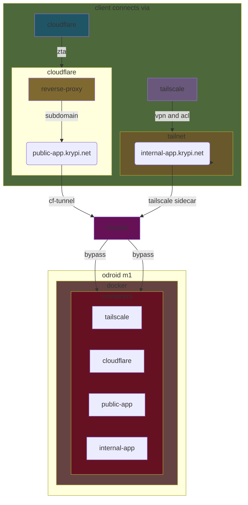

# ka's personal homeops documentation etc

This project will document a self-hosted environment running on an **Odroid M1** board and is supposed to be self contained.

It is meant to maximise the homeops (lul) enviroment and just run on this single board, with as many apps and services as possible.

The project will only use **free** and/or **open source** software, the enterprise stuff will run in the homelab-environment.

> [!IMPORTANT]
> The content of this repository is provided "as is", with no guarantee that the information is complete or error-free.
> The techniques and tools discussed here come with inherent risks.
> The author takes absolutely no responsibility for possible consequences due to the use of the related software.

# Table of Content
 

1. 

   
<a href="#overview">Overview</a>

    1. [Plan](#plan)
    2. [Architecture](#architecture)

   

2. 

   
<a href="oOdroid setup">Odroid setup</a>

    1. [step-name](#step-comment)

   

3. 

   
<a href="#initial-prep">Initial prep</a>

    1. [step1](#step1)

   

4. 

   
<a href="#network-configuration">Network configuration</a>

    1. [ip-stuff](#ip-stuff)

   

5. 

   
<a href="#install-services">Install services</a>

    1. [service1](#service1)
   
   

6. 

   
<a href="#docker-apps">Docker apps</a>

    1. [app1](#app1)

   

7. 

   
<a href="#acknowledgments">Acknowledgments</a>

   

8. 

   
<a href="#license">License</a>

   

  
# Overview

## Plan

There have been many steps in this project, and it has been hosted on different hardware, running different stacks of software since 2022?

The primary design principles were set to the following, after much deliberation;

- **kiss** (because I always overcomplicate everything)
- **self-hosted within reason** (take the hardware as far as it goes, reach out to cloud when there is a determined need)
- **privacy first** (software should honor privacy, encrypt everything))
- **cloud-agnostic** (cheapest and best is the way to go)
- **secure** (authentication, zero-trust, encryption, logging, backup etc)
- **light** (4 arm-cores and 4GB RAM is not a lot.)
- **container-first** (for deployability, transferability etc.)
- **accessible** (usability wherever I'm at)
- **monitored** (monitoring, alerting, tracking, the good stuff)

These are the tools we are going to run :

|                                       Logo                                        | Name           | Repository                                  | Description                                          |
|:---------------------------------------------------------------------------------:|----------------|---------------------------------------------|------------------------------------------------------|
|                  | Docker         | https://github.com/docker                   | Help to build, share, and run container applications |
|  | Docker Compose | https://github.com/docker/compose           | Run multi-container applications with Docker         |
|                    | Kopia          | https://github.com/kopia/kopia              | Fast and secure open-source backup/restore tool      |
|        | Uptime Kuma    | https://github.com/louislam/uptime-kuma     | Easy-to-use self-hosted monitoring tool              |
|        | Tailscale    | https://github.com/tailscale/tailscale    | Private WireGuard® networks made easy|

Below is a general connectivity diagram for the hosted services;

# Acknowledgments

Acks go here :

# License

Please refer to the license of each product mentioned in this guide.

Otherwise, the **GPL v3** license applies.

[General Public License (GPL) v3](https://www.gnu.org/licenses/gpl-3.0.en.html)

This program is free software: you can redistribute it and/or modify it under the terms of the GNU
General Public License as published by the Free Software Foundation, either version 3 of the
License, or (at your option) any later version.

This program is distributed in the hope that it will be useful, but WITHOUT ANY WARRANTY; without
even the implied warranty of MERCHANTABILITY or FITNESS FOR A PARTICULAR PURPOSE. See the GNU
General Public License for more details.

You should have received a copy of the GNU General Public License along with this program. If not,
see <http://www.gnu.org/licenses/>.