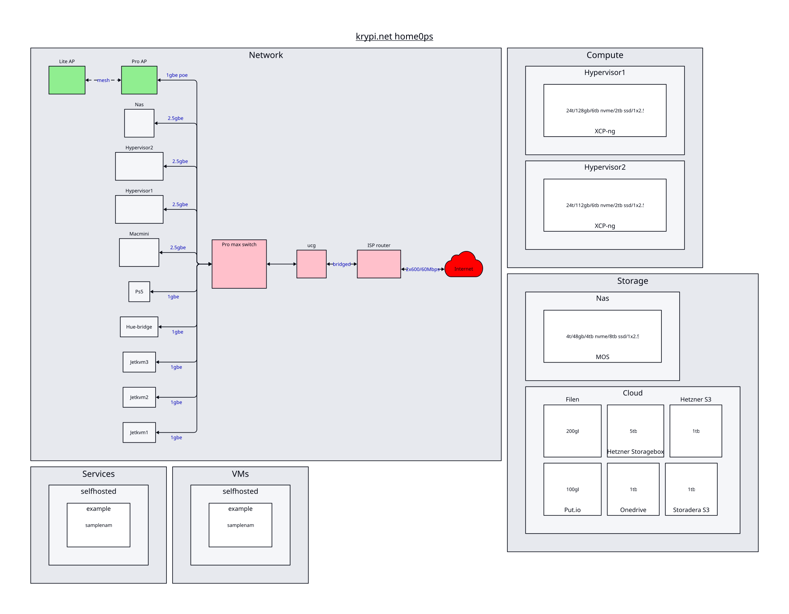

# home0ps

Personal home-lab and home-ops repo: Docker Compose service stacks, infrastructure-as-code (OpenTofu), bootstrap/provisioning scripts, and supporting diagrams for a self-hosted environment.

> [!IMPORTANT]
> The content of this repository is provided "as is", with no guarantee that the information is complete or error-free.
> The techniques and tools discussed here come with inherent risks.
> The author takes absolutely no responsibility for possible consequences due to the use of the related software.

## Design principles

- **kiss** (because I always overcomplicate everything)
- **self-hosted within reason** (take the hardware as far as it goes, reach out to cloud when there is a determined need)
- **privacy first** (software should honor privacy, encrypt everything)
- **cloud-agnostic** (cheapest and best is the way to go)
- **secure** (authentication, zero-trust, encryption, logging, backup etc)
- **container-first** (for deployability, transferability etc.)
- **accessible** (usability wherever I'm at)
- **monitored** (monitoring, alerting, tracking, the good stuff)

## Repository layout

| Path              | What's in it                                                                                           |
|-------------------|---------------------------------------------------------------------------------------------------------|
| `docker-compose/` | One subfolder per service stack, each with its own `compose.yaml`                                       |
| `iac/`            | OpenTofu -- Cloudflare DNS (`iac/cloudflare/`), plus Hetzner Cloud / NetBird config (`main.tf`, `netbird.tf`, `server_vm.tf`) |
| `config-files/`   | Bootstrap/setup scripts and dotfiles for `linux`, `rpi`, and `win` hosts                                 |
| `files/scripts/`  | Standalone install/maintenance scripts (Docker install, rclone backup, Time Machine snapshot purge, Windows bootstrap) |
| `files/pix/`, `images/` | Logo and image assets used in this README and in diagrams                                         |
| `d2/`             | [d2](https://d2lang.com/)-format architecture, threat-modeling, and SOC-process diagrams                |
| `archive/`        | Retired docs and diagrams, kept for reference and not actively maintained                                |

## Services (docker-compose stacks)

| Stack                | Image(s)                                                                                   | What it is |
|-----------------------|---------------------------------------------------------------------------------------------|------------|
| `archiveteamwarrior` | `atdr.meo.ws/archiveteam/warrior-dockerfile`                                                | ArchiveTeam Warrior -- distributed web-archiving client |
| `atuin`              | `ghcr.io/atuinsh/atuin`, `postgres:14`                                                       | Synced, searchable shell history |
| `base`               | `fnsys/dockhand:latest`                                                                      | Dockhand -- Docker management UI |
| `cloudflare`         | `cloudflare/cloudflared:latest`                                                              | Cloudflare Tunnel client (config incomplete -- see TODO in the compose file) |
| `docker-socket-proxy`| `tecnativa/docker-socket-proxy`                                                              | Restricts what talks to the Docker socket, for containers that only need read-only API access |
| `dockge`             | `louislam/dockge:1`                                                                          | Docker Compose stack manager UI |
| `dozzle`             | `amir20/dozzle:latest`                                                                       | Real-time Docker log viewer |
| `fahgpu`             | `yurinnick/folding-at-home:latest-nvidia`                                                    | Folding@home, GPU-accelerated |
| `gatus`              | `twinproduction/gatus:latest`                                                                | Status page / synthetic monitoring (ICMP, TCP, DNS, SSH checks) |
| `glances`            | `joweisberg/glances:latest`                                                                  | System resource monitoring |
| `golink`             | `ghcr.io/tailscale/golink:main`                                                              | Short, memorable `go/` links |
| `healthchecks`       | `lscr.io/linuxserver/healthchecks:latest`                                                    | Self-hosted [healthchecks.io](https://healthchecks.io/) -- cron/job dead-man's-switch monitoring |
| `homeassistant`      | `ghcr.io/home-assistant/home-assistant:stable`                                               | Home Assistant |
| `homepage`           | `ghcr.io/gethomepage/homepage:latest`                                                        | Dashboard / service homepage |
| `infra`              | `docker-socket-proxy`, `dozzle`, `atuin` + `postgres`, `healthchecks`                        | Combined stack bundling several of the above -- check which of this or the standalone folders is the one actually deployed |
| `iot`                | `ghcr.io/athombv/homey-shs`                                                                  | Homey smart-home hub server |
| `librespeed`         | `ghcr.io/linuxserver/librespeed`                                                             | Self-hosted internet speed test |
| `pocketid`           | `ghcr.io/pocket-id/pocket-id:v2`                                                             | Pocket ID -- passkey-based OIDC identity provider |
| `shields`            | `shieldsio/shields:server-2024-03-01`                                                        | Self-hosted Shields.io badge server |
| `test-macvlan`       | `nginx:latest`                                                                               | Scratch stack for testing macvlan networking |
| `unifi-controller`   | `jacobalberty/unifi`, `mongo:3.6`                                                            | UniFi network controller |
| `uptime-kuma`        | `louislam/uptime-kuma:1.23.11`                                                               | Uptime/status monitoring |
| `vikunja`            | `vikunja/vikunja`, `mariadb:10`                                                              | To-do / task management |
| `whoami`             | `denga/whoami:latest`                                                                        | Minimal HTTP echo service, useful for testing routing |
| `xos`                | `ronivay/xen-orchestra:latest`                                                               | Xen Orchestra -- management UI for an XCP-ng hypervisor |

A root-level `compose.yaml` also runs its own `dozzle` instance (fronted with Cloudflare Access auth headers), separate from `docker-compose/dozzle/`. Worth reconciling which one is actually the live deployment.

## Network & hardware topology

Two XCP-ng hypervisors (Hypervisor1: 24t/128GB/6TB nvme/2TB ssd, Hypervisor2: 24t/112GB/6TB nvme/2TB ssd), a NAS running MOS, and cloud storage spread across OneDrive (1TB), Filen (200GB), Storadera S3 (1TB), Hetzner S3 (1TB), Hetzner Storagebox (5TB), and Put.io (100GB). Source diagram: [`d2/homelab-topology.d2`](d2/homelab-topology.d2).

## Infrastructure as code (`iac/`)

- **`iac/cloudflare/`** -- manages Cloudflare DNS records for `krypi.net`, `m41w423mu572un.xyz`, and `obviousphish.com` via OpenTofu (zones are created manually in the dashboard; Terraform only looks them up and manages records). Applied by `.github/workflows/deploy-cloudflare-dns.yml` -- plan on PR, apply on push to `main`.
- **`iac/main.tf`, `iac/netbird.tf`, `iac/server_vm.tf`** -- Hetzner Cloud and NetBird provider config; `server_vm.tf` currently has its server resource commented out. Applied by `.github/workflows/deploy-iac.yml`.

## Not yet documented

- Detailed IP addressing / VLAN assignment (the topology diagram above shows link speeds and physical layout, not the addressing scheme)
- Backup and disaster-recovery plan
- Secrets management approach

## Acknowledgments

Acks go here :

## License

Please refer to the license of each product mentioned in this guide.

Otherwise, the **GPL v3** license applies.

[General Public License (GPL) v3](https://www.gnu.org/licenses/gpl-3.0.en.html)

This program is free software: you can redistribute it and/or modify it under the terms of the GNU
General Public License as published by the Free Software Foundation, either version 3 of the
License, or (at your option) any later version.

This program is distributed in the hope that it will be useful, but WITHOUT ANY WARRANTY; without
even the implied warranty of MERCHANTABILITY or FITNESS FOR A PARTICULAR PURPOSE. See the GNU
General Public License for more details.

You should have received a copy of the GNU General Public License along with this program. If not,
see <http://www.gnu.org/licenses/>.
