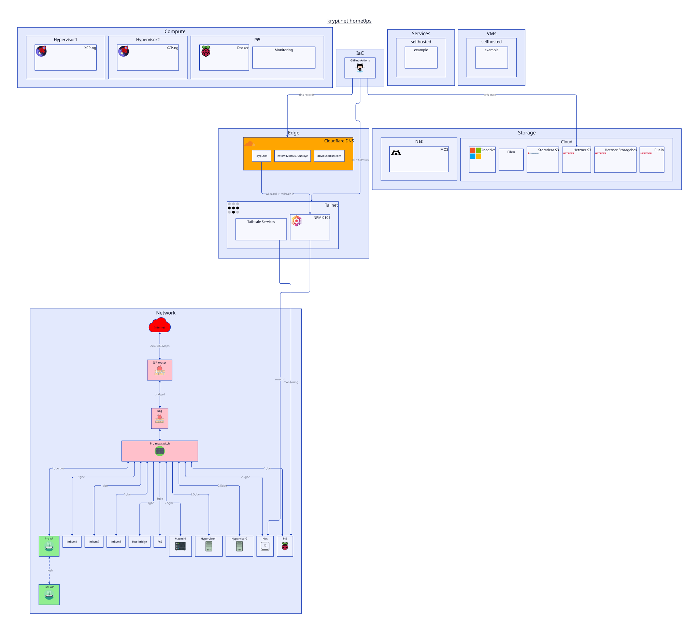

# home0ps

Personal home-lab and home-ops repo: Docker Compose service stacks, infrastructure-as-code (OpenTofu), bootstrap/provisioning scripts, and supporting diagrams for a self-hosted environment.

> [!IMPORTANT]
> The content of this repository is provided "as is", with no guarantee that the information is complete or error-free.
> The techniques and tools discussed here come with inherent risks.
> The author takes absolutely no responsibility for possible consequences due to the use of the related software.

## Design principles

- **kiss** (because I always overcomplicate everything)
- **self-hosted within reason** (take the hardware as far as it goes, reach out to cloud when there is a determined need)
- **privacy first** (software should honor privacy, encrypt everything)
- **cloud-agnostic** (cheapest and best is the way to go)
- **secure** (authentication, zero-trust, encryption, logging, backup etc)
- **container-first** (for deployability, transferability etc.)
- **accessible** (usability wherever I'm at)
- **monitored** (monitoring, alerting, tracking, the good stuff)

## Repository layout

| Path              | What's in it                                                                                           |
|-------------------|---------------------------------------------------------------------------------------------------------|
| `docker-compose/` | Active service stacks, one subfolder per stack with its own `compose.yaml`; retired stacks are in `archive/docker-compose/` |
| `iac/`            | Infrastructure as code, one folder per area: `iac/hetzner/`, `iac/cloudflare/`, `iac/tailscale/` (see below) |
| `.github/workflows/` | One path-scoped deploy pipeline per `iac/` area, plus `readme-weekly.yml` (weekly README refresh)     |
| `config-files/`   | Bootstrap/setup scripts and dotfiles for `linux`, `rpi`, and `win` hosts                                 |
| `files/scripts/`  | Standalone install/maintenance scripts (Docker install, rclone backup, Time Machine snapshot purge, Windows bootstrap) |
| `files/pix/`, `images/` | Logo and image assets used in this README and in diagrams                                         |
| `d2/`             | [d2](https://d2lang.com/)-format architecture, threat-modeling, and SOC-process diagrams                |
| `archive/`        | Retired docs, diagrams and config (e.g. NetBird), kept for reference and not actively maintained          |
| `CLAUDE.md`, `MISTAKES.md` | Working rules for AI-assisted changes, and the log of past mistakes those rules come from        |

## Services (docker-compose stacks)

| Stack        | Image(s) | What it is |
|--------------|----------|------------|
| `monitoring` | `twinproduction/gatus`, `henrygd/beszel`, `henrygd/beszel-agent`, `amir20/dozzle`, `tecnativa/docker-socket-proxy` | Hardened monitoring stack: Gatus status page, Beszel hub + local agent, Dozzle log viewer, read-only Docker socket proxy. UIs bind to `127.0.0.1` and are published as Tailscale Services (`svc:gatus`, `svc:beszel`, `svc:dozzle`). Host-specific values come from `.env` (see `.env.example`). |

Earlier stacks were retired to [`archive/docker-compose/`](archive/docker-compose/README.md).

## Network & hardware topology

Two XCP-ng hypervisors (Hypervisor1: 24t/128GB/6TB nvme/2TB ssd, Hypervisor2: 24t/112GB/6TB nvme/2TB ssd), a NAS running MOS, and cloud storage spread across OneDrive (1TB), Filen (200GB), Storadera S3 (1TB), Hetzner S3 (1TB), Hetzner Storagebox (5TB), and Put.io (100GB). Source diagram: [`d2/homelab-topology.d2`](d2/homelab-topology.d2).

## Infrastructure as code (`iac/`)

One folder per area, one workflow per folder. A change under `iac/<area>/` triggers only that area's workflow, and each workflow gets only the secrets it needs.

| Area | What it manages | Workflow | PR | Merge to `main` |
|------|-----------------|----------|----|-----------------|
| [`iac/cloudflare/`](iac/cloudflare/README.md) | DNS records (OpenTofu) | `deploy-cloudflare-dns.yml` | fmt, validate, plan | apply, **after a manual approver** (`environment: production`) |
| `iac/hetzner/` | Hetzner Cloud (OpenTofu) | `deploy-hetzner.yml` | fmt, validate, plan | apply, no approver |
| `iac/tailscale/` | Tailscale ACL policy (`policy.hujson`) | `deploy-tailscale-acl.yml` | ACL test | apply, **no approver -- merging is deploying** |

- **`iac/cloudflare/`** -- DNS records for `krypi.net`, `m41w423mu572un.xyz`, and `obviousphish.com`. Zones are created manually in the dashboard; OpenTofu only looks them up and manages records. Also holds the internal reverse-proxy wildcards (`*.<id>.int.krypi.net` -> Tailscale IP, DNS-only), driven by `proxies.yaml` -- see [`iac/cloudflare/README.md`](iac/cloudflare/README.md).
- **`iac/hetzner/`** -- Hetzner Cloud provider config; `server_vm.tf` currently has its server resource commented out.
- **`iac/tailscale/`** -- the tailnet ACL policy, applied with [`tailscale/gitops-acl-action`](https://github.com/tailscale/gitops-acl-action). Login identities and local account names are `${...}` placeholders in the committed file, filled from GitHub secrets at runtime; the rendered file exists only on the ephemeral runner. The PR test job is the only gate; the policy's `tests` block checks that trusted devices and privusers reach `tag:proxy` on 80/443/81 and are denied unrelated ports elsewhere. The latter fails if the break-glass catch-all grant is left enabled.
- **Retired:** NetBird -- config in `archive/netbird/`.
- **README refresh:** `readme-weekly.yml` runs Mondays (and on manual dispatch). If anything landed on `main` in the last 7 days, Claude checks this README against the repo and opens a draft PR with a summary of the week; the run fails if anything other than `README.md` was touched.

### State and providers

- OpenTofu state lives in S3-compatible object storage, one state key per area (e.g. `hetzner/terraform.tfstate`). Backends use partial configuration: only `key` is in `backend.tf`; endpoint and bucket come from secrets at `tofu init`.
- Providers are pinned to an exact version and each root module commits its `.terraform.lock.hcl`; provider upgrades go in their own PR. (`iac/hetzner/` still uses `~> 1.60` without a lock file -- to be aligned.)

### Secrets

No credentials, bucket names or personal identities are committed. Code only references `var.*` / `${{ secrets.* }}`; values live in GitHub repository secrets. Tokens are least-privilege (Cloudflare: DNS on the named zones; Tailscale: OAuth client scoped to the policy file).

| Workflow | Secrets |
|----------|---------|
| `deploy-cloudflare-dns.yml` | `CLOUDFLARE_API_TOKEN`, `CLOUDFLARE_ACCOUNT_ID`, state: `S3_ENDPOINT`, `S3_BUCKET`, `HETZNER_ACCESS_KEY_ID`, `HETZNER_SECRET_ACCESS_KEY` |
| `deploy-hetzner.yml` | `HCLOUD_TOKEN`, state: `S3_ENDPOINT`, `S3_BUCKET`, `HETZNER_ACCESS_KEY_ID`, `HETZNER_SECRET_ACCESS_KEY` |
| `deploy-tailscale-acl.yml` | `TS_OAUTH_CLIENT_ID`, `TS_OAUTH_SECRET`, `TS_TAILNET`, placeholders: `TS_PRIVUSER`, `TS_GUEST`, `LOCAL_UNIX_ACCOUNT`; optional `SLACK_WEBHOOK_URL` (only used when repo variable `SLACK_NOTIFY=true`) |
| `readme-weekly.yml` | `CLAUDE_CODE_OAUTH_TOKEN` (plus the built-in `github.token`) |

## Contributing / changing things

- One branch and one PR per change and per area (`feat/<area>-<slug>`, `fix/<area>-<slug>`, `chore/<slug>`). Nothing is pushed straight to `main`.
- Read the plan's summary line (`N to add, N to change, N to destroy`), not the job colour; the PR states what's expected.
- AI-assisted work follows [`CLAUDE.md`](CLAUDE.md); lessons from past mistakes are logged in [`MISTAKES.md`](MISTAKES.md).

## Not yet documented

- Detailed IP addressing / VLAN assignment (the topology diagram above shows link speeds and physical layout, not the addressing scheme)
- Backup and disaster-recovery plan

## Acknowledgments

Acks go here :

## License

Please refer to the license of each product mentioned in this guide.

Otherwise, the **GPL v3** license applies.

[General Public License (GPL) v3](https://www.gnu.org/licenses/gpl-3.0.en.html)

This program is free software: you can redistribute it and/or modify it under the terms of the GNU
General Public License as published by the Free Software Foundation, either version 3 of the
License, or (at your option) any later version.

This program is distributed in the hope that it will be useful, but WITHOUT ANY WARRANTY; without
even the implied warranty of MERCHANTABILITY or FITNESS FOR A PARTICULAR PURPOSE. See the GNU
General Public License for more details.

You should have received a copy of the GNU General Public License along with this program. If not,
see <http://www.gnu.org/licenses/>.
